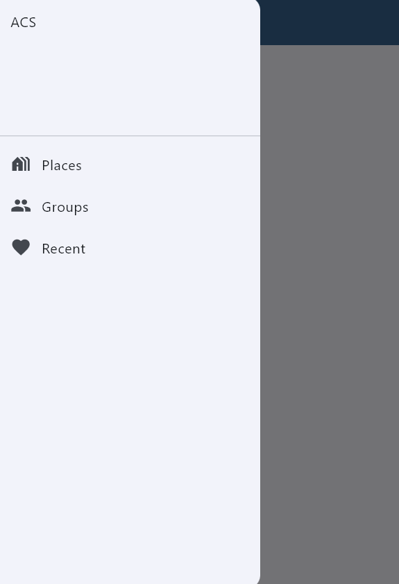
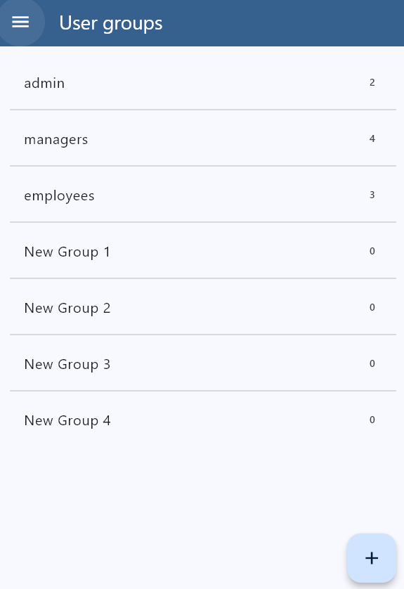
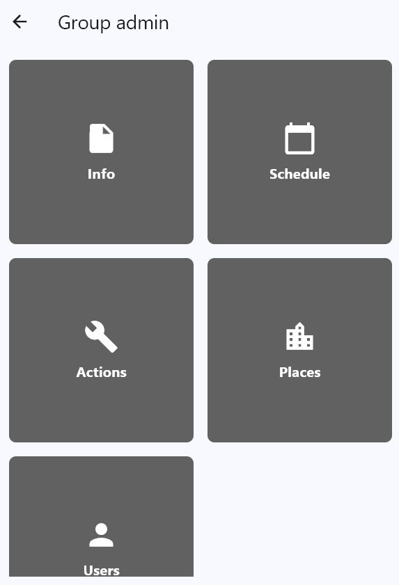
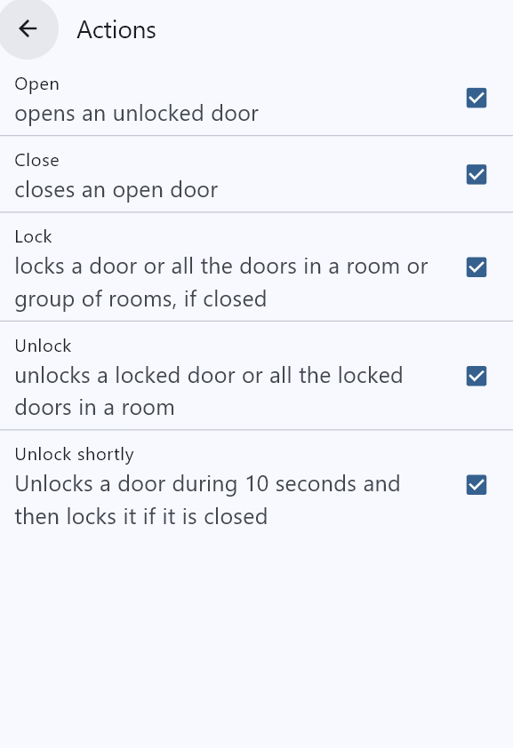
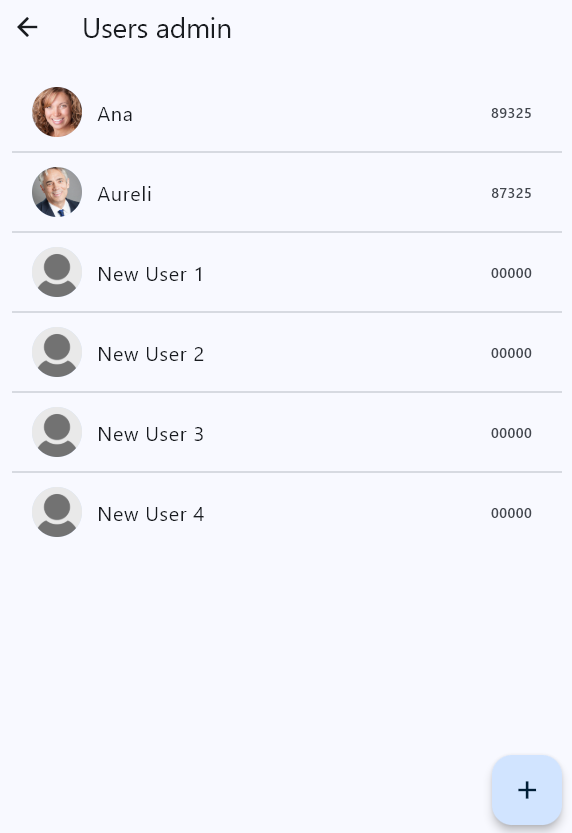
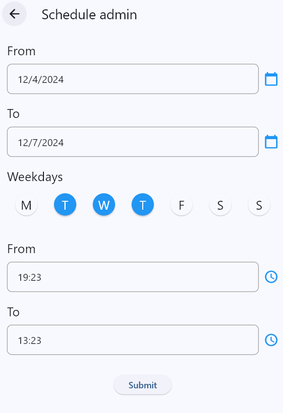

# ACS

The app that this project builds is a demo of one which would work as user management system for an ACS (Acces Control System)

## Characteristics

- Built using Flutter
- Let's you create new groups of employees with different permissions and schedules each
- Inside each group you can create employees within it and modificate what can and can not do

## Screenshots








## Languages used

- Dart (for Flutter)

## Installation

- 1️⃣ Create a new Android Studio project
- 2️⃣ Once it's made add to the lib folder in local the same files that there are in the homonimous folder in this repository
- 3️⃣ Execute the app with Windows(desktop) as the device

```bash
git clone https://github.com/DaBM17/Weather-App
cd "Weather App"
